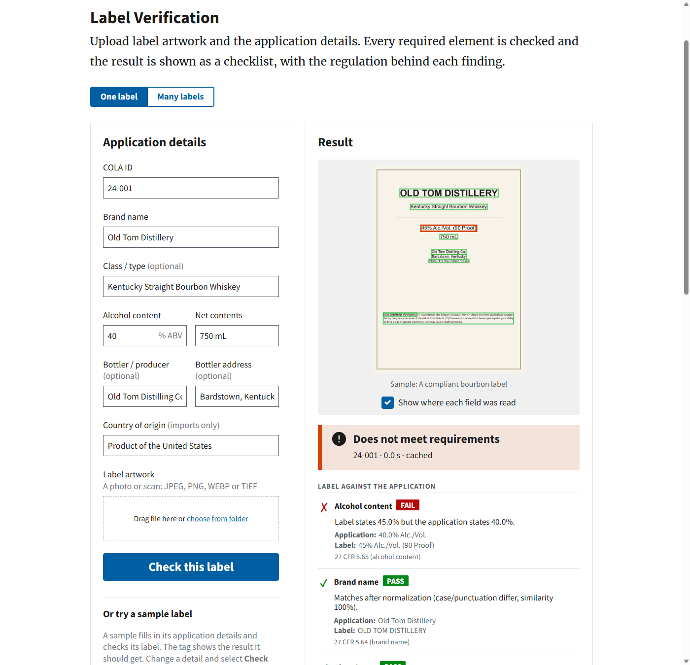

# TTB Label Verification Prototype

[](https://github.com/sheldon904/ttb-label-verifier/actions/workflows/ci.yml)

This tool checks alcohol label artwork against its COLA application. It shows a
compliance agent what matched, what did not and why. Local OCR reads the label, plain
rules decide, and every finding cites the regulation behind it.

> **Live prototype:** https://ttb-label-verifier-opal.vercel.app



## Try it in a minute

1. Open the app and pick a sample under **Or try a sample label**. A tag beside each
   sample shows the result it should get. The sample fills in its application details
   and the checklist appears beside the artwork. A box marks where each field was read;
   select a checklist row to pick out its box.
2. Change the alcohol content in the form and select **Check this label**. The tool
   checks the same sample against the edited application, and that row fails.
3. Pick the photograph with glare. OCR cannot read part of it, so the label is referred
   at once. A second reading clears it a few seconds later, and each cleared row says
   where its reading came from.
4. Pick the two labels made with an AI image generator, as the brief suggests. The wine
   passes. The bourbon fails: the image model printed "alcoholic alcoholic" in its
   warning, and the checklist shows that word.
5. Select **Many labels**, then **Run the sample batch**. Fifty-two labels, fifteen of
   them AI-generated, run with a progress bar, a summary and a CSV export. Referrals
   sort by how likely each is to be a real defect.
6. Upload your own artwork under **One label**: JPEG, PNG, WEBP or TIFF. Only the COLA ID
   and the brand name are required.
7. Read the API documentation at `/docs`.

## Approach

- **OCR reads, rules decide.** Tesseract reads the label inside the app. Plain rules in
  `app/rules/` compare each field with the application and the regulation, and every
  finding cites its CFR section.
- **Three results: Pass, Review and Fail.** A rejection has to survive an appeal. So a
  reading the tool is unsure of sends the label to an agent and never fails it.
- **Harm is what the evaluation gates on.** `make eval` fails if a compliant label is
  rejected or a defective one passes, in either fixture set. CI runs it on every push,
  and all three Tesseract builds pass it.
- **Models assist and never decide.** A vision model's second reading can clear a
  referral and can never reject. Jev orders the referral queue. Without their
  credentials, the app makes no outbound call.
- **One container, one page and a JSON API.** A batch runs in the browser against the
  single-label endpoint, so the server stores nothing.

[`docs/DECISIONS.md`](docs/DECISIONS.md) traces every requirement to its source in the
brief and explains each decision.

## What it checks

The brief lists seven elements a label must carry. The tool checks all seven, plus the
two things the worked example adds: the proof statement and the warning's typography.

| Element | How the label is compared | Citation for spirits |
|---|---|---|
| Brand name | The same words once case, punctuation, spacing and accents are set aside. One letter different, or part of the brand, goes to an agent. | 27 CFR 5.64 |
| Class / type | The same words. A similar designation, or one inside the other, goes to an agent. | 5.63(a)(2), subpart I |
| Alcohol content | The percentage exactly. The proof must equal twice the percentage. A reading ten times the application's, or one the label's own proof contradicts, is a misread and goes to an agent. The wording form is advisory. | 5.65 |
| Net contents | Units converted first: `750 mL` = `0.75 L`, `12 FL OZ` = `355 mL`, `1 PINT 6 FL OZ`, `1/2 GALLON`. The statement must use the units the part requires. A size no spirit or wine bottle comes in is a misread. | 5.70, 5.203 |
| Bottler name and address | Read from the "Bottled by" or "Imported by" statement. The name's own words are compared, so "Distilling Co." alone matches nothing. A wrong name fails; a different address goes to an agent. | 5.66 to 5.68 |
| Country of origin | Imports only. The same country passes, a similar spelling goes to an agent and a different country fails. | 5.69, 19 CFR 134.11 |
| Government warning | Word by word against the statute. An added or changed word, "not" dropped or a phrase cut out fails. A difference a misread produces goes to an agent with the words listed. | 16.21 |
| Warning heading | `GOVERNMENT WARNING` in capital letters (fails otherwise) and bold (measured, advisory). The type-size minimum for this container is stated. | 16.22(a)(2), 16.22(b) |

The citations follow the commodity. The class/type designation decides it: a beer cites
part 7, a wine part 4 and a spirit part 5. A designation that names no commodity cites
all three parts. A beer or a table wine without an alcohol statement goes to an agent,
because parts 7 and 4 make the statement optional there. Spirits and wine state net
contents in liters or milliliters and malt beverages in U.S. units, so "75 cl" alone on
a whisky goes to an agent with 5.70(a) quoted.

Each row gets one of three results: **Pass**, **Review** or **Fail**. A label fails when
a row fails and needs review when a row needs a person. The checklist answers two
questions separately: does the label match its application, and does the label meet the
regulation on its own terms.

## Measured results

The evaluation runs every label through the full pipeline, one at a time, in two sets:

- **37 rendered labels** in three artwork styles, drawn by `fixtures/generate.py`. Every
  word on them is known, and every threshold was tuned on them.
- **15 AI-generated labels**, drawn by Gemini image models as the brief suggests. Eleven
  are flat labels, some with arched or ornamental lettering or light type on a dark card.
  Four are phone photographs. Their truth was read off each image by eye. The image model
  got five warnings wrong, so those labels are defective as printed.

The same labels run on three Tesseract builds, because the builds disagree on individual
reads.

| Tesseract build | Rendered, correct of 37 | AI-generated, correct of 15 | **Harmful** | p95 |
|---|---|---|---|---|
| 5.4.0, Windows | 34 | 5 | **0** | 1.02 s |
| 5.5.0, Debian (the container) | 34 | 5 | **0** | 1.21 s |
| 5.3.4, Ubuntu 24.04 (CI) | 34 | 5 | **0** | 1.35 s |

- **Harmful** counts a compliant label rejected, a defective label passed and any single
  row failed in error. `make eval` exits non-zero on one harmful outcome in either set,
  or under 80% accuracy on the rendered set.
- **Every miss is a referral.** On the rendered set, three photographs of compliant
  labels go to an agent. On the AI set, OCR cannot read arched and ornamental brands, and
  border ornaments break up the warning. Of the five warnings the image model got wrong,
  the repeated word fails. The other four go to an agent with every difference listed.
- **On its first run,** the AI set scored 6 of 15 and rejected 4 of its 7 compliant
  labels. [`docs/DECISIONS.md`](docs/DECISIONS.md) lists what those labels found.

A stress test goes further (`make stress`). It makes 210 degraded copies of the 14
compliant rendered labels, under blur, shrinking, heavy JPEG, rotation, dimming, low
contrast, noise and glare. Its first run rejected 99 of 225 copies. Now it rejects 10,
all under glare that erases a line or the warning. Three more come back as unreadable,
with a request for a better copy: two blurred past reading and one tilted photograph at
half brightness ([`eval/out/report-stress.md`](eval/out/report-stress.md)).

Sarah Chen's budget is 5 seconds a label. The median is 0.9 seconds on Windows and 1.0
in the container, and the live site takes 1.6 to 2.3. A 300-label importer batch takes
about a minute with 8 workers on Windows and 1.4 minutes with the container's 4. On the
live site, the 52-label sample batch took 67 seconds with the second reading on.

**With the second reading on**, a vision model re-reads what OCR could not. Three models
ran on the same labels through OpenRouter:

| Second-reading model | Rendered, of 37 | AI-generated, of 15 | Harmful | Slowest consulted label | Cost per consulted label |
|---|---|---|---|---|---|
| **Claude Sonnet 5** (default) | **35** | **7** | **0** | **4.9 s** | $0.0057 |
| Gemini 3.8 Flash | 35 | 8 | 0 | 6.9 s | $0.0021 |
| GPT-6 Luna | 35 | 7 | 0 | 7.0 s | $0.0001 |

The single-label page shows the OCR result at once and updates when the second reading
lands. On the glare sample, the referral showed after 1.1 seconds and the cleared result
at 4.6.

Every report is in [`eval/out/`](eval/out/): one per build and per second-reading model,
two throughput runs, the stress test and the live triage run.

## How it uses AI

- **OCR reads every label.** Tesseract, a neural-network OCR engine, runs inside the app.
  Rules turn its reading into findings.
- **No model decides a verdict.** A rejection must survive an appeal, so its reason has
  to be quotable: "The sixth word of your warning reads X, 27 CFR 16.21 requires Y."
  Marcus Williams's firewall also blocked the last vendor's model endpoints, and no
  verdict here needs one.
- **A second reading** (Claude Sonnet 5 through OpenRouter) re-reads only the fields OCR
  could not read on a referred label. The rules run again on its reading, and a row
  changes only if it now passes. It can clear a referral and can never reject. It answers
  through a typed tool call. OpenRouter sends it only to providers that do not store or
  train on requests. A cache, a daily limit and a credit limit on the credential cap the
  cost.
- **The second reading never touches the warning's wording.** A vision model knows the
  statute by heart and tends to return it whole. A reading that "clears" a warning looks
  the same as one that corrected an altered statement back to the statute. That altered
  statement is the defect Jenny Park described, so the wording stays with OCR and the
  agent.
- **Referral triage** (Jev through Vercel AI Gateway) estimates which referrals in a batch
  are real defects, so the queue starts with them. Jev receives only the tool's own
  findings: field names, verdicts and scores. Label text never reaches it, because the
  applicant writes the label. Without a gateway credential, a local heuristic ranks the
  queue.

Each model feature switches on only when its credential is present. Without them, the
app makes no outbound connection.

## Running it

The app needs Python 3.11 or newer and Tesseract.

```bash
git clone https://github.com/sheldon904/ttb-label-verifier.git
cd ttb-label-verifier

# Tesseract
#   macOS             brew install tesseract
#   Debian / Ubuntu   sudo apt install tesseract-ocr
#   Windows           winget install UB-Mannheim.TesseractOCR
#                     (the default install path is found automatically)

# macOS, Linux and WSL
make install
make test               # 456 tests, no network, no paid calls
make eval               # both fixture sets, one label at a time
make eval-throughput    # the same with 8 workers
make stress             # 210 degraded copies of compliant labels, about 4 minutes
make dev                # http://localhost:8000
```

On Windows without `make`, run the same steps in PowerShell:

```powershell
python -m venv .venv
.venv\Scripts\python -m pip install -r requirements-dev.txt
.venv\Scripts\python -m pytest -q
.venv\Scripts\python -m eval.run
.venv\Scripts\python -m uvicorn app.main:app --port 8000
```

To run the container instead, the only requirement is Docker:

```bash
docker build -t ttb-label-verifier .
docker run --rm -p 8000:8000 ttb-label-verifier
```

### Configuration

| Variable | Default | Effect |
|---|---|---|
| `MAX_BATCH_CONCURRENCY` | 8 (4 in the container) | Labels in the OCR pool at once. The batch page reads it. |
| `OMP_THREAD_LIMIT` | 1 | Threads per Tesseract process. The pool already runs labels in parallel, and a thread per core made the container's batch 23 times slower. |
| `MAX_UPLOAD_BYTES` | 12 MiB | Largest image or records file accepted |
| `MAX_BATCH_LABELS` | 500 | Largest batch accepted |
| `RATE_LIMIT_PER_MINUTE` | 600 | Review requests per address per minute, more than the OCR pool can check. The batch page waits out a 429. |
| `TRUST_PROXY_HEADERS` | off | Behind a load balancer, take the address from `X-Forwarded-For` |
| `OPENROUTER_API_KEY` | none | Turns on the second reading. Set a credit limit on this credential. |
| `ANTHROPIC_API_KEY` | none | Turns on the second reading through Anthropic when there is no OpenRouter credential |
| `SECOND_OPINION` | `auto` | `auto` uses OpenRouter, then Anthropic, whichever credential is set. `openrouter`, `anthropic` or `off` choose. |
| `SECOND_OPINION_MODEL` | provider default | `anthropic/claude-sonnet-5` on OpenRouter, `claude-sonnet-5` on Anthropic. Any vision model on OpenRouter works. |
| `SECOND_OPINION_DAILY_LIMIT` | 300 | Paid second readings per day per instance |
| `AI_GATEWAY_API_KEY` | none | Lets triage ask Jev. Without it, a Vercel deployment uses the token Vercel sends with each request. |
| `TRIAGE` | `jev` | Jev when a gateway credential exists, else the local heuristic. `heuristic` or `off` choose. |

To set these locally, copy `.env.example` to `.env`; the app reads it at start. The
page footer states which model features are on. The evaluation calls no paid model
unless asked (`--second-opinion openrouter`), so `make eval` and CI stay free.

### Deployment

The image installs Tesseract, runs as an unprivileged user and answers on `/healthz`.
CI builds it and checks two sample verdicts on every push.

**On Vercel**, which runs `Dockerfile.vercel` as a function, import the repository as a
new project, set these variables and deploy:

| Variable | Value |
|---|---|
| `PORT` | `8000`. Vercel sends traffic to port 80 unless this is set. |
| `OPENROUTER_API_KEY` | an OpenRouter credential with a credit limit, for the second reading |
| `TRUST_PROXY_HEADERS` | `1` |
| `AI_GATEWAY_API_KEY` | an AI Gateway credential, for Jev. Without one, the app uses the token Vercel sends with each request. |

Leave out any variable you do not set a value for. A blank one counts as unset.

`Dockerfile.vercel` is a copy of `Dockerfile`, and a test keeps the two identical. An
idle deployment scales to zero, so the first request after a quiet spell starts the
container. Vercel refuses a request over 4.5 MB. The page therefore shrinks a larger
photo to the 2,200-pixel size OCR reads before sending it.

**On Azure**, where the TTB already runs, the same image suits Azure Container Apps.
[Microsoft documents](https://learn.microsoft.com/en-us/azure/container-apps/containerapp-up)
this command for a directory with a Dockerfile. I did not run it.

```bash
az containerapp up --name ttb-label-verifier --source . --ingress external --target-port 8000
```

## Tools used

- Claude Code, Anthropic's coding agent, as the engineering partner (see
  [How it was built](#how-it-was-built))
- Python 3.12, FastAPI, Uvicorn, Pydantic and Jinja2
- Tesseract OCR 5 through pytesseract, with Pillow and NumPy to prepare each image
- RapidFuzz for the fuzzy matches
- The U.S. Web Design System 3.14 for the page, served from the app with no CDN
- httpx for the two model calls: OpenRouter (Claude Sonnet 5) and Vercel AI Gateway (Jev)
- Gemini image models through OpenRouter, which drew the fifteen AI-generated test labels
- pytest, Ruff, GitHub Actions and Docker
- Playwright and axe-core for the browser and accessibility checks during development

## How it was built

I built this with Claude Code working as my engineering partner. I turned the interviews
into the requirements traced in `docs/DECISIONS.md`. I set the rule that a false
rejection is the worst outcome, and I decided what shipped. Claude Code wrote and revised
the code and ran the tests and measurements. It also drafted these documents from the
results.

Three controls kept that work honest:

- **Tests and a harm gate.** CI runs 456 tests and the full evaluation on every push. The
  evaluation fails on any harmful outcome.
- **Measured claims.** Every number in these documents comes from a measured run. The
  evaluation and stress-test reports are saved in [`eval/out/`](eval/out/).
- **Separate review passes.** Other Claude Code sessions, told to break the tool, drew
  stress labels and wrote the stress test. Many of the corrections in
  [`docs/DECISIONS.md`](docs/DECISIONS.md) came from them.

## Assumptions

The brief is a set of interviews with no formal requirements section, so these are my
readings of it:

1. **Application records arrive as CSV or JSON beside the images,** joined on the COLA
   ID. The brief never says how application data enters the system. Column names are
   matched flexibly, so a spreadsheet export works without reshaping.
2. **The class/type designation names the commodity.** The application carries no
   commodity field, so the tool infers it from words such as "Whiskey", "Cabernet" or
   "Ale".
3. **No COLA integration,** per Marcus. The tool is a standalone proof of concept.
4. **Nothing is kept.** Uploads are discarded when each check finishes. The OCR cache
   keeps readings, never images, in memory.
5. **The label and the application must state the same alcohol content.** The 0.3-point
   tolerance in 27 CFR 5.65(c) is between the label and the liquid, which is a
   laboratory question.

## Limitations

- **Jev is measured on 18 referrals.** On the live deployment it ranks a genuine referral
  ahead of a reading problem in 72% of pairs. The local heuristic manages 46%, with 41%
  ties. Jev scores a soft-focus photograph and one AI-generated import as likely
  defects: [`eval/out/report-triage-jev-live.md`](eval/out/report-triage-jev-live.md).
- **An image cannot give millimetres.** 27 CFR 16.22 sets a minimum type size and a
  maximum number of characters per inch. The tool states the minimum for the container
  so the agent knows what to check.
- **The bold measurement rests on few samples:** one regular sample for each case
  pairing. Between the bands, the row says it cannot tell.
- **Glare, soft focus and heavy compression defeat OCR.** The tool refers those labels.
  The second reading clears the glare photograph and leaves the other two with an agent.
- **Glare that erases a line leaves OCR nothing to read.** The statement under it reads
  as missing or as another line, and the label fails. The stress test found this on 10
  of 210 copies.
- **A dim, tilted photograph can come back unread.** The page then asks for a brighter
  copy. A grey deskew fill read it, but the same fill made a compliant phone photo fail.
- **A misprint one letter off the statute goes to an agent.** The rules cannot tell it
  from a misread, so the row lists the difference and the agent rejects the label.
- **Class and type is compared as text.** The tool does not check the designation
  against the standards of identity.
- **Batch progress lives in the browser.** A page refresh loses it, because the server
  stores nothing.
- **The thresholds are tuned on rendered labels** and checked against fifteen
  AI-generated ones. Real COLA artwork will move some of them.

## More detail

[`docs/DECISIONS.md`](docs/DECISIONS.md) traces each requirement to its source in the
brief. It also records each design decision, the rules that make OCR safe enough to
reject on and what the measurements corrected along the way.
